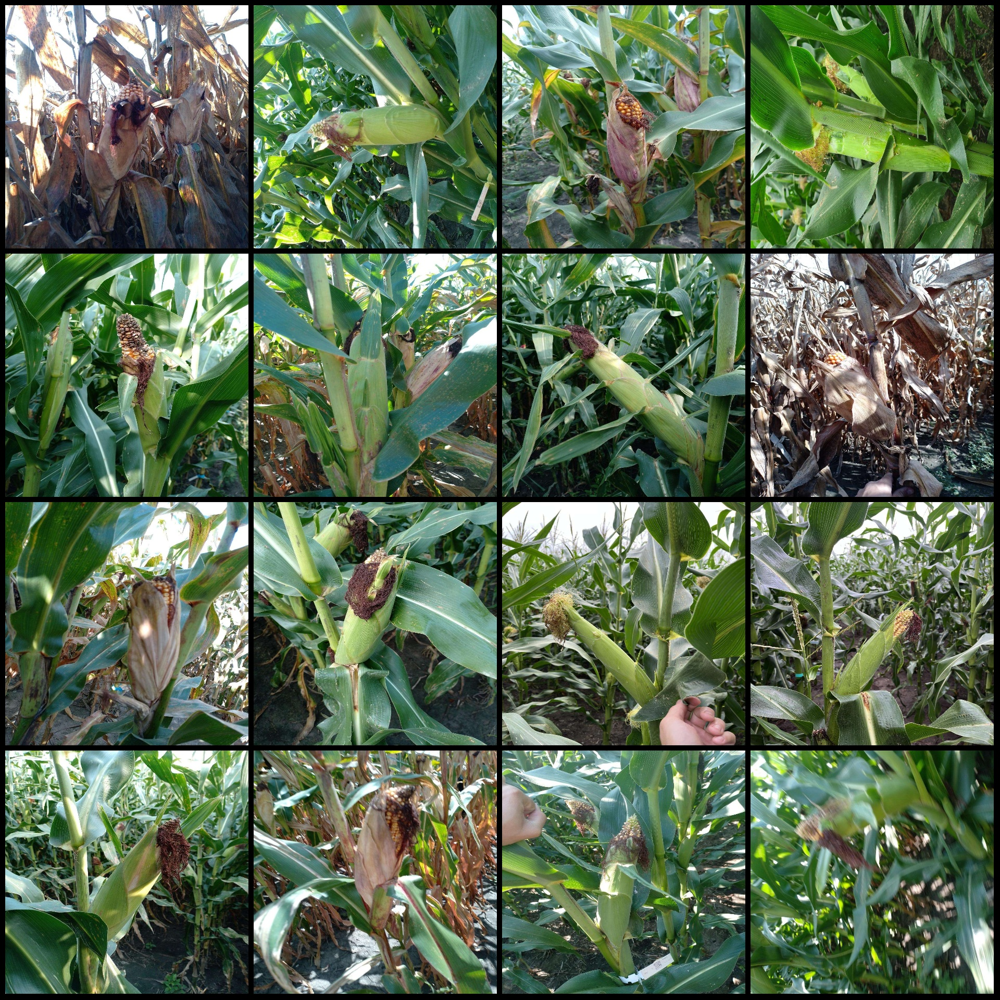
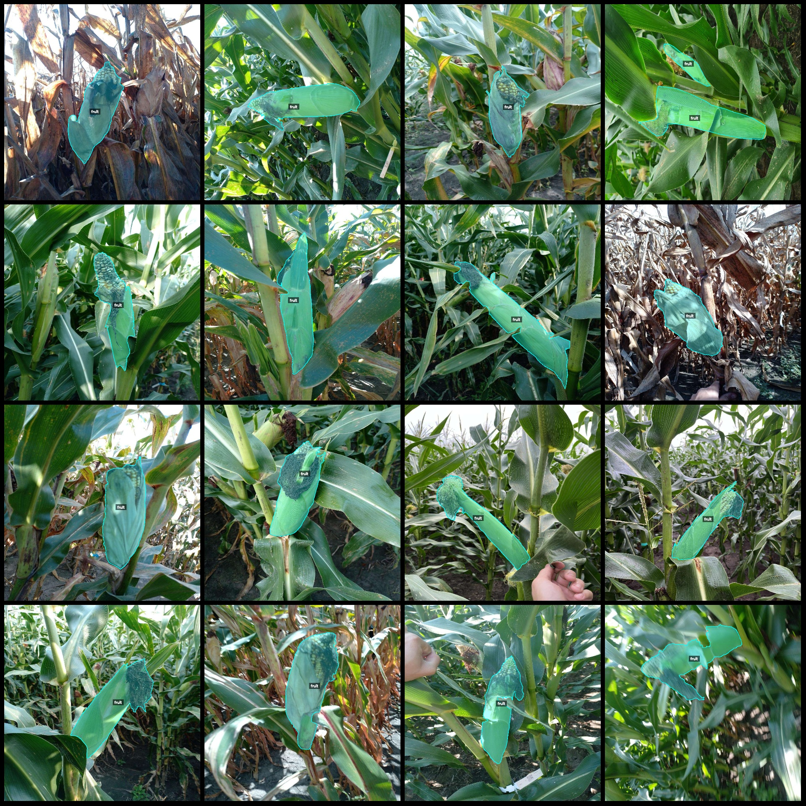
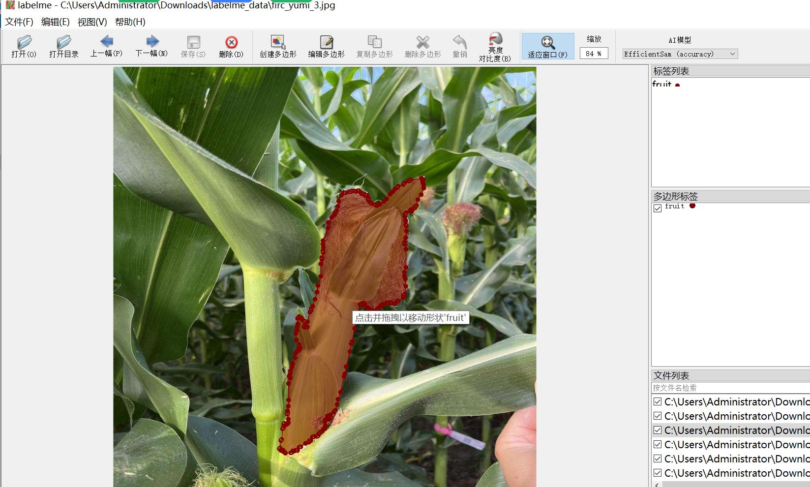

# Intelligent Agriculture Field Identification and Segmentation of Maize Ears and Cobs Dataset in labelme Format with 3271 Entries

The dataset format: labelme format (excluding mask files, only containing jpg images and corresponding json files)

Number of Image Files (jpg file count): 3258
Number of Annotation Files (json file count): 3258
Number of Annotation Categories: 1
Annotation Category Name: "fruit"
Number of Boxes per Category: 3271
Total Boxes: 3271

Labelme version used for the data: v5.5.0
Image resolution: 1024x1024
Annotation rules: Polygon boxes are drawn around the category
Important Note: The dataset can be edited in labelme, but the json dataset needs to be converted into a format such as mask or Yolo or COCO for semantic segmentation or instance segmentation.
Special Remark: This dataset does not guarantee the accuracy of the trained models or weight files.
Sample Images:
Annotation Example:
Original Image (randomly select 16 images):
Annotation drawing result:
Labelme editing image example:

## Images

Here is a pay link on Stripe ( https://buy.stripe.com/3cs8yP7sY87d0vu9AB ). Please contact me lonlonago@foxmail.com after funding $89, and I will send you a complete data files , thank you!

